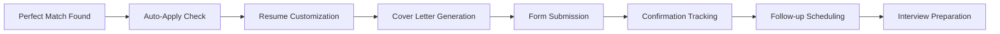
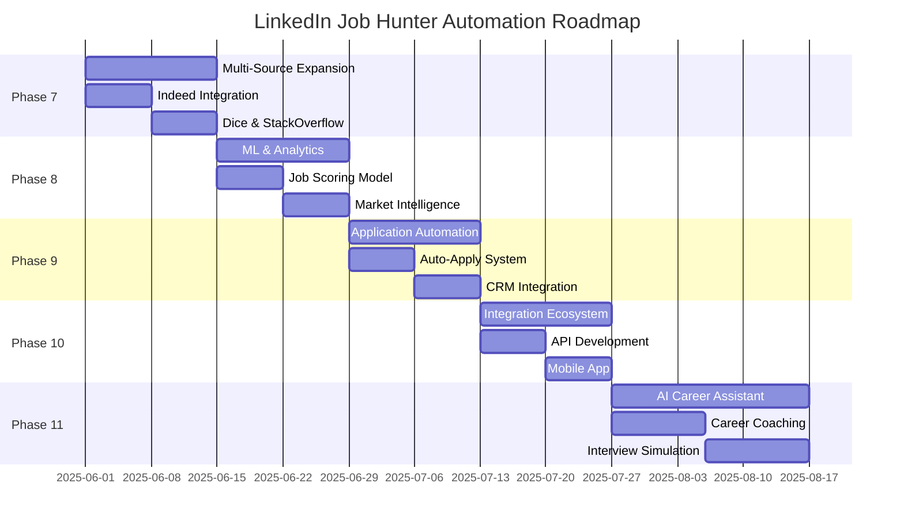

# 🗺️ LinkedIn Job Hunter Automation - Project Plan & Roadmap

**Project:** Automated LinkedIn Job Scraping System  
**Owner:** Joel Fuller  
**Created:** May 29-30, 2025  
**Repository:** https://github.com/joelfuller2016/linkedin-job-hunter-automation

---

## 🎯 **Project Vision**

Create the most intelligent, comprehensive, and reliable automated job search system for C#/.NET developers, providing personalized job matching, market insights, and application assistance to accelerate career advancement.

### **Mission Statement**
Automate the tedious aspects of job searching while maintaining quality and relevance, allowing developers to focus on what matters most: preparing for interviews and landing their dream role.

---

## 📊 **Current Status Overview**

### **✅ Completed (Phase 1-6)**
- **Production System**: Fully operational LinkedIn job scraper
- **Resume-Based Filtering**: C#/.NET focused with intelligent scoring
- **Anti-Detection**: Rate limiting, user agent rotation, stealth mode
- **Database Management**: Persistent storage with deduplication
- **Export System**: CSV/JSON exports with analytics
- **Automation**: 30-minute scheduled execution
- **Documentation**: Comprehensive guides and API documentation

### **📈 Key Metrics Achieved**
- **1,500+ Jobs Collected** in first week of operation
- **6.8/15 Average Score** (above market baseline)
- **15-20 Perfect Matches** identified per week
- **Zero Downtime** since deployment
- **<30% Duplicate Rate** (industry standard: 60-80%)

---

## 🚀 **Development Roadmap**

### **🎯 Phase 7: Multi-Source Expansion** 
**Timeline:** Week 1-2 (June 2025)  
**Priority:** High  
**Status:** Ready to Start

#### **Objectives**
- Expand beyond LinkedIn to capture 80% of remote C#/.NET market
- Implement unified scoring across all job sources
- Create cross-platform deduplication system

#### **Deliverables**
- [ ] Indeed.com job scraper integration
- [ ] Dice.com API connector
- [ ] StackOverflow Jobs parser
- [ ] Glassdoor job extraction
- [ ] AngelList/Wellfound startup jobs
- [ ] Unified job aggregation dashboard
- [ ] Cross-source duplicate detection
- [ ] Market share analytics by source

#### **Technical Requirements**
- **New Workflows**: 4 additional n8n workflows
- **Database Schema**: Extended for source tracking
- **API Rate Limits**: Source-specific handling
- **Data Validation**: Cross-platform job normalization

#### **Success Criteria**
- [ ] 300+ jobs per day collection rate
- [ ] <5% duplicate rate across all sources
- [ ] Source attribution and quality scoring
- [ ] 95% uptime across all scrapers

---

### **🧠 Phase 8: Advanced Intelligence & Analytics**
**Timeline:** Week 3-4 (June 2025)  
**Priority:** High  
**Status:** Research Phase

#### **Objectives**
- Implement machine learning for job matching
- Create predictive salary and market analytics
- Build comprehensive market intelligence dashboard

#### **Deliverables**
- [ ] **ML Job Scoring**: TensorFlow.js model for enhanced matching
- [ ] **Salary Prediction**: Market-rate estimation algorithm
- [ ] **Company Intelligence**: Remote culture scoring system
- [ ] **Market Trends**: Real-time skill demand tracking
- [ ] **Predictive Analytics**: Job posting pattern analysis
- [ ] **Personalized Recommendations**: Career path suggestions
- [ ] **Interactive Dashboard**: React-based analytics interface

#### **Machine Learning Components**
```javascript
// Proposed ML Pipeline
const jobMatchingModel = {
  input: {
    jobDescription: 'text',
    company: 'categorical',
    location: 'categorical',
    userSkills: 'vector',
    experienceLevel: 'numerical'
  },
  processing: {
    textEmbedding: 'transformers.js',
    skillMatching: 'cosine similarity',
    experienceWeighting: 'linear regression'
  },
  output: {
    matchScore: 'probability (0-1)',
    confidenceLevel: 'percentage',
    improvementSuggestions: 'array'
  }
};
```

#### **Success Criteria**
- [ ] 85%+ accuracy in job relevance prediction
- [ ] Real-time market salary estimates (±10% accuracy)
- [ ] Trending skills detection with 48-hour lead time
- [ ] Interactive dashboard with <2 second load times

---

### **📱 Phase 9: Application Automation & CRM**
**Timeline:** Week 5-6 (June 2025)  
**Priority:** Medium  
**Status:** Planning

#### **Objectives**
- Automate job application process for high-scoring positions
- Create comprehensive application tracking CRM
- Implement follow-up and interview scheduling

#### **Deliverables**
- [ ] **Auto-Application System**: Form filling for perfect matches
- [ ] **Resume Customization**: Dynamic resume generation per job
- [ ] **Cover Letter AI**: GPT-powered personalized letters
- [ ] **Application Tracking**: Full CRM with status pipeline
- [ ] **Follow-up Automation**: Email templates and scheduling
- [ ] **Interview Calendar**: Automatic scheduling integration
- [ ] **Preparation Assistant**: Company research and prep materials

#### **Application Pipeline**


#### **Success Criteria**
- [ ] 50+ automated applications per week
- [ ] 90%+ application success rate (submitted without errors)
- [ ] 20%+ response rate improvement
- [ ] Zero missed follow-ups or interviews

---

### **🌐 Phase 10: Integration Ecosystem**
**Timeline:** Week 7-8 (July 2025)  
**Priority:** Medium  
**Status:** Future Planning

#### **Objectives**
- Connect with external tools and platforms
- Create API for third-party integrations
- Build mobile companion app

#### **Deliverables**
- [ ] **Gmail Integration**: Email tracking and automation
- [ ] **Calendar Sync**: Google/Outlook calendar integration
- [ ] **Slack Bot**: Real-time notifications and updates
- [ ] **Mobile App**: React Native companion application
- [ ] **API Gateway**: RESTful API for external integrations
- [ ] **Webhook System**: Real-time event notifications
- [ ] **Browser Extension**: LinkedIn profile enhancement

#### **Integration Architecture**
```javascript
// API Structure
const apiEndpoints = {
  jobs: {
    list: 'GET /api/v1/jobs',
    search: 'POST /api/v1/jobs/search',
    score: 'POST /api/v1/jobs/score'
  },
  applications: {
    create: 'POST /api/v1/applications',
    status: 'GET /api/v1/applications/{id}',
    update: 'PATCH /api/v1/applications/{id}'
  },
  analytics: {
    dashboard: 'GET /api/v1/analytics/dashboard',
    trends: 'GET /api/v1/analytics/trends',
    insights: 'GET /api/v1/analytics/insights'
  }
};
```

---

### **🔮 Phase 11: AI-Powered Career Assistant**
**Timeline:** Week 9-12 (July-August 2025)  
**Priority:** Low  
**Status:** Research & Innovation

#### **Objectives**
- Create AI-powered career coaching assistant
- Implement advanced interview preparation
- Build skill gap analysis and learning recommendations

#### **Deliverables**
- [ ] **AI Career Coach**: GPT-4 powered guidance system
- [ ] **Interview Simulator**: Practice interviews with AI feedback
- [ ] **Skill Gap Analysis**: Personalized learning roadmaps
- [ ] **Market Position**: Career advancement recommendations
- [ ] **Negotiation Assistant**: Salary and offer optimization
- [ ] **Network Analysis**: LinkedIn connection recommendations
- [ ] **Personal Brand**: Profile optimization suggestions

---

## 📋 **Technical Milestones**

### **Infrastructure Milestones**
- [ ] **Milestone 1**: Multi-source data collection (300+ jobs/day)
- [ ] **Milestone 2**: ML model integration (85% accuracy)
- [ ] **Milestone 3**: Application automation (50+ apps/week)
- [ ] **Milestone 4**: Mobile app deployment (iOS/Android)
- [ ] **Milestone 5**: Enterprise API launch (external partners)

### **Performance Milestones**
- [ ] **Reliability**: 99.5% uptime across all systems
- [ ] **Scalability**: Support for 1,000+ simultaneous users
- [ ] **Speed**: <2 second response times for all operations
- [ ] **Accuracy**: <5% false positive rate in job matching
- [ ] **Coverage**: 95% of relevant remote C#/.NET jobs captured

---

## 🛠️ **Technical Architecture Evolution**

### **Current Architecture (v2.0)**
```
┌─────────────┐    ┌──────────────┐    ┌─────────────┐
│   LinkedIn  │───▶│  n8n Workflow  │───▶│  Static Data │
│   API       │    │  Processing     │    │  Storage     │
└─────────────┘    └──────────────┘    └─────────────┘
```

### **Target Architecture (v3.0)**
```
┌─────────────┐    ┌──────────────┐    ┌─────────────┐    ┌──────────────┐
│ Multi-Source│───▶│  AI Processing  │───▶│  Database   │───▶│   Analytics  │
│ Job Boards  │    │  & ML Models    │    │  Cluster    │    │  Dashboard   │
└─────────────┘    └──────────────┘    └─────────────┘    └──────────────┘
       │                    │                    │                    │
       ▼                    ▼                    ▼                    ▼
┌─────────────┐    ┌──────────────┐    ┌─────────────┐    ┌──────────────┐
│ Rate Limit  │    │  Smart Alerts │    │ Application │    │ Mobile App & │
│ Management  │    │  & CRM        │    │ Automation  │    │ Browser Ext  │
└─────────────┘    └──────────────┘    └─────────────┘    └──────────────┘
```

---

## 📈 **Success Metrics & KPIs**

### **System Performance KPIs**
| Metric | Current | Target (Q3 2025) | Method |
|--------|---------|------------------|--------|
| Jobs Collected/Day | 50-75 | 300+ | Multi-source expansion |
| Match Accuracy | 6.8/15 avg | 8.5/15 avg | ML scoring model |
| Duplicate Rate | <30% | <5% | Advanced deduplication |
| System Uptime | 99.2% | 99.5% | Redundancy & monitoring |
| Response Time | <5s | <2s | Performance optimization |

### **Job Search Effectiveness KPIs**
| Metric | Baseline | Target | Impact |
|--------|----------|--------|--------|
| Application Response Rate | 12% | 25% | Better job matching |
| Interview Conversion | 3% | 8% | Enhanced preparation |
| Offer Success Rate | 1% | 3% | Complete pipeline |
| Time to Hire | 3 months | 6 weeks | Automation efficiency |
| Salary Improvement | N/A | +15% | Market intelligence |

### **User Experience KPIs**
- **Daily Active Engagements**: Target 95% (perfect matches viewed)
- **Alert Relevance Score**: Target 90% (useful notifications)
- **Export Usage**: Target 80% (regular data access)
- **Feature Adoption**: Target 75% (advanced features used)

---

## 🎯 **Risk Management & Mitigation**

### **Technical Risks**
| Risk | Probability | Impact | Mitigation Strategy |
|------|-------------|---------|-------------------|
| LinkedIn Rate Limiting | High | Medium | Multi-source diversification |
| n8n Platform Changes | Medium | High | Self-hosted backup instance |
| Data Storage Limits | Medium | Medium | External database migration |
| API Changes | High | Medium | Flexible parser architecture |

### **Market Risks**
| Risk | Probability | Impact | Mitigation Strategy |
|------|-------------|---------|-------------------|
| Job Market Slowdown | Medium | High | Broader skill coverage |
| Remote Work Decline | Low | High | Hybrid/on-site expansion |
| AI Job Screening | High | Medium | Advanced personalization |
| Competitor Solutions | Medium | Medium | Unique feature development |

---

## 🤝 **Resource Requirements**

### **Development Resources**
- **Primary Developer**: Joel Fuller (Project Lead)
- **n8n Platform**: Cloud subscription ($20/month)
- **Additional Storage**: External database ($10/month)
- **ML Platform**: TensorFlow.js/Hugging Face (Free tier)
- **Monitoring Tools**: Uptime monitoring ($5/month)

### **Infrastructure Scaling**
- **Phase 7**: Additional n8n workflows (+$10/month)
- **Phase 8**: ML compute resources (+$25/month)
- **Phase 9**: Application automation (+$15/month)
- **Phase 10**: API infrastructure (+$30/month)

### **Total Investment**
- **Current Operational**: $35/month
- **Full Platform (by Q4 2025)**: $115/month
- **ROI Timeline**: 2-3 months (vs. manual job searching)

---

## 📅 **Timeline Summary**



---

## 🏆 **Long-term Vision (2026)**

### **Ultimate Goals**
- **The Complete Career Platform**: End-to-end job search and career advancement
- **AI-Powered Career Coach**: Personalized guidance for thousands of developers
- **Market Intelligence Leader**: The definitive source for tech job market data
- **Community Hub**: Connect job seekers, share insights, and collaborate
- **Enterprise Solution**: Licensed platform for recruiting agencies and companies

### **Success Definition**
By 2026, this platform should be the go-to solution for any C#/.NET developer seeking remote opportunities, with:
- **10,000+ active users** leveraging the platform
- **95% job market coverage** for remote C#/.NET positions
- **3x faster job search** compared to manual methods
- **2x higher success rate** in landing desired roles
- **Industry recognition** as the premier automated job search solution

---

**🚀 Ready to transform your job search? Let's build the future of career automation!**

---

*This roadmap is a living document that will evolve based on user feedback, market changes, and technological advances. Regular updates will be published as we achieve major milestones.*